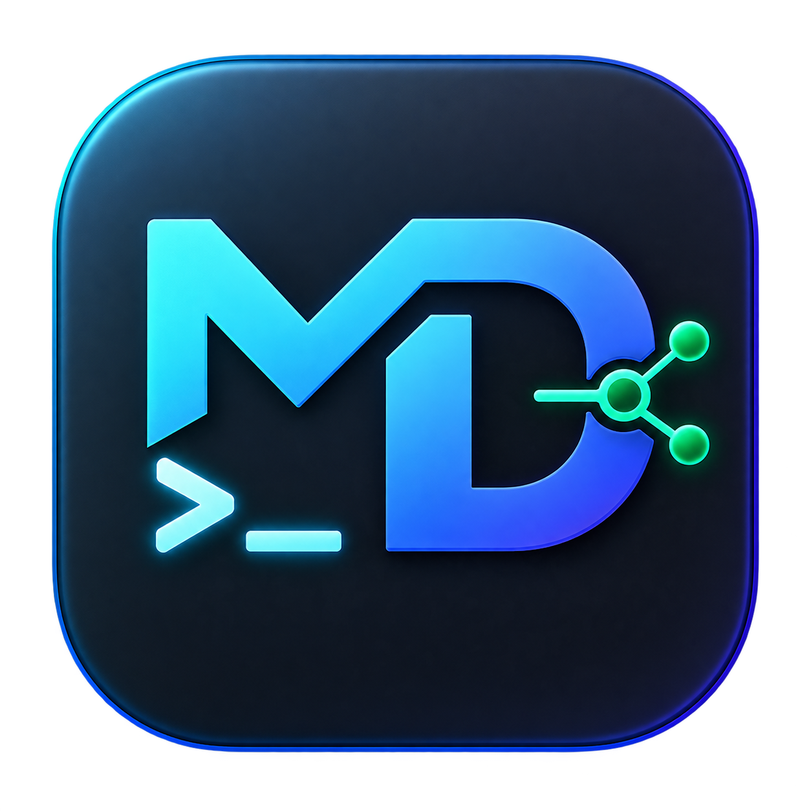
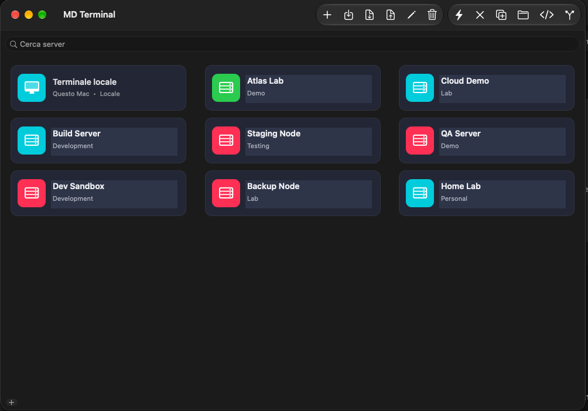
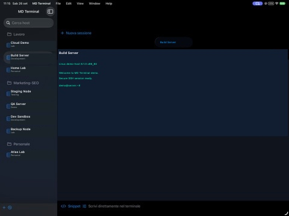

<p align="center">
  
</p>

<h1 align="center">MD Terminal</h1>

<p align="center">
  Client SSH nativo e open source per macOS e iPadOS.<br>
  Nessun abbonamento. Credenziali sotto il tuo controllo.
</p>

<p align="center">
  
  
  
  
</p>

## Anteprima

| macOS | iPadOS |
| --- | --- |
|  |  |

## Funzioni

- Connessioni SSH tramite password o chiave privata.
- Password e passphrase protette nel Keychain.
- Verifica host key e gestione `known_hosts`.
- Terminale VT100/Xterm con SwiftTerm e colori ANSI.
- Sessioni multiple persistenti a schede.
- Gestione host, gruppi, preferiti, ricerca e duplicazione.
- File manager SFTP locale/remoto con drag & drop.
- Snippet, port forwarding e import di `~/.ssh/config`.
- Esportazione di host e credenziali in archivio AES-256-GCM.
- Condivisione opzionale dell'archivio tramite storage self-hosted.

## Installazione macOS

Scarica il pacchetto dalla sezione [Releases](https://github.com/marchino321/MDTerminal/releases) oppure compila localmente:

```sh
git clone https://github.com/marchino321/MDTerminal.git
cd MDTerminal
./scripts/build-app.sh release
open dist/MDTerminal.app
```

La build AppKit usa OpenSSH incluso in macOS. `StrictHostKeyChecking=ask` è sempre attivo: una chiave nuova richiede conferma e una chiave cambiata viene bloccata.

## Installazione iPadOS

1. Clona il repository e apri `MDTerminal.xcodeproj` in Xcode.
2. Seleziona lo scheme **MDTerminal-iPad**.
3. Imposta il tuo Team di firma.
4. Collega l'iPad, selezionalo come destinazione e premi **Run**.

Con un account Apple gratuito la firma deve essere rinnovata periodicamente; con Apple Developer dura più a lungo.

## Sviluppo e test

Avvio macOS:

```sh
swift run MySSH
```

Test automatici:

```sh
swift test --scratch-path /tmp/mdterminal-swift-tests
```

## Sicurezza

- Nessuna password è salvata nel file dati o nel repository.
- Le credenziali locali restano nel Keychain.
- Gli archivi portabili sono cifrati con AES-256-GCM.
- La passphrase dell'archivio non viene memorizzata e va condivisa separatamente.

## Vibe Coding Report

MD Terminal 1.0 è stato realizzato in due chat di contesto: circa **5 ore e 55 minuti end-to-end** e **2 ore e 30 minuti di esecuzione Codex**. Leggi il [report completo](VIBE_CODING_REPORT.md).

## Licenza

Distribuito con licenza [MIT](LICENSE).
